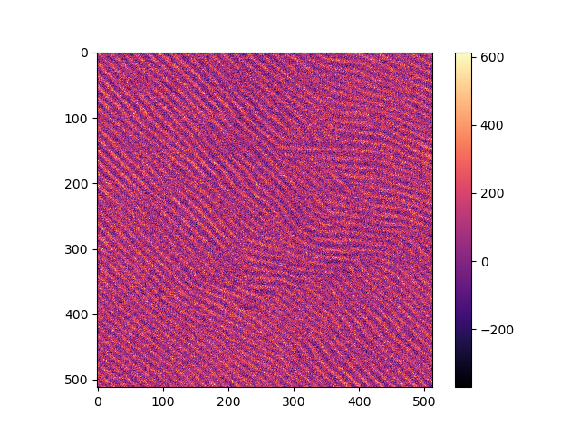
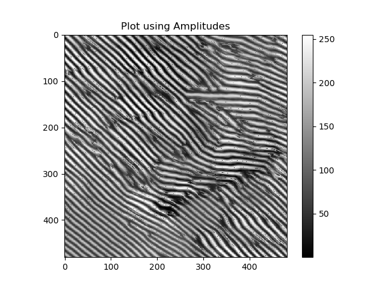

# WaveRider -- A Wave Feature Recognition Tool
#### Authored by R Godbey for Hudson Research Group, Penn State University
This is a series of scripts that produces a neural network with the intent of
using it detect bifurcations and other topological defects in materials examined
with a scanning tunneling microscope (STM).

## Table of Contents

* [Introduction](https://github.com/rag5495/waverider#introduction)
* [Dependencies](https://github.com/rag5495/waverider#dependencies)
* [Description of Scripts](https://github.com/rag5495/waverider#description-of-scripts)

### Introduction
When a surface is being examined by an STM, there are often a lot of external
factors that can add noise to the image. There are also a lot of impurities in
the data, such as structures that resemble radial gaussians or spherical caps.
There are instances where the data is so convoluted by these defects that it makes
it very difficult to analyze both qualitatively and quantitatively in any
meaningful way. The purpose of WaveRider is to extract various features of the
standing waves on the surface of the material such as the phase shift, angle of
rotation, wavelength, and amplitude. The model is able reproduce bifurcations
and eliminate topological defects. Below is an example of a complex surface with
several bifurcations.

 | 
:--------------------------------------:|:------------------------------------------:
Original Data (Input to Model) | Plot of Model Prediction (Output of Model)

### Dependencies
Use the package manager [pip](https://pip.pypa.io/en/stable/) to install the following:

`pip install tensorflow numpy matplotlib datetime pillow`

### Description of Scripts

#### Datagen.py
Creates two lists of data to be used in the training and validation of the neural
network. The script creates standing wave patterns in 2-d numpy arrays of shape
(subSize, subSize) with varying wavelength, angle of rotation, and phase shift.
Applies random sampling from a normal gaussian distribution to 20% of the list as
noise and uses the "noisy" data as the training dataset.

In order to change the size of the samples generated, change the subsize as seen below:

`17 | subSize = 32`

The mean and variance of the gaussian distribution that the noise is sampled from
are designated by the variables mu and sigma respectively:

`57 | mu = 0`
`58 | sigma = 0.1`

#### Splice.py
Takes the input image and splits it into smaller arrays of shape (subSize, subSize)
by sampling at each pixel, iterating by row and column. The output of this is the
input array for the trained model, along with the list of mins and maxs of each
individual 2-d array.

#### ModelAWTP.py
